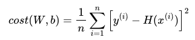
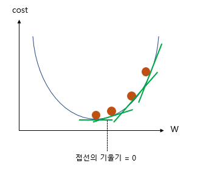
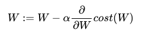

H(x) = Wx+b  
 W 가중치
b 편향

### 1. Loss function

MSE(Mean Squared Error, 평균제곱오차) : 오차 제곱 합 평균

### 2. Opimizer - Gradient Descent

  
loss가 가장 낮은 지점을 찾자 -> 기울기가 0
기울기가 낮은 방향으로 W update

-   기울기가 음수일 때 -> W 증가
-   기울기가 양수일 때 -> W 감소

여기서 ɑ는 learning rate
