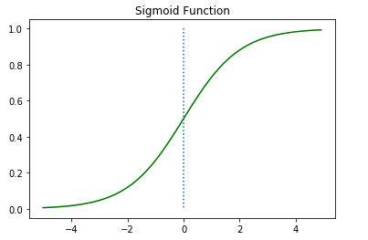
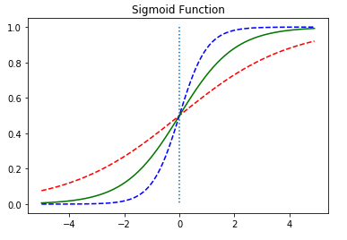
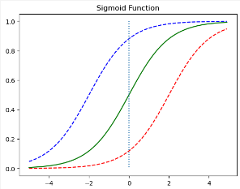
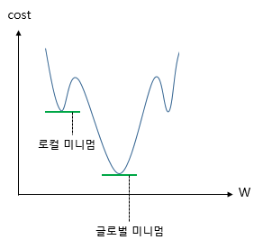
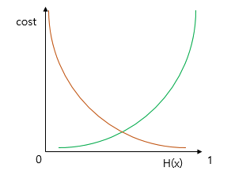
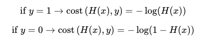
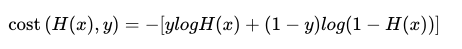
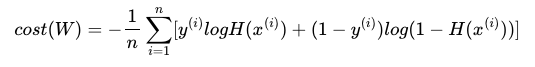

$$H(x) = f(Wx+b)$$  

### 1. 시그모이드 함수

  
  

여기서 W는 경사도를 의미  
  

-   W가 커지면 경사가 가파라짐
-   W가 작아지면 경사가 완만해짐

b는 이동  
  

-   +b 파랑
-   -b 빨강

### 2. 시그모이드 함수를 이용한 분류

output: 0과 1사이 값
이진 분류에서 쓰임

### 3. Loss function

  
MSE 사용시 로컬 미니멈 문제발생

#### 시그모이드의 오차함수

  
y = 0.5 에 대칭  

로그를 씌워 표현
  
  
오차의 평균 구하기  

