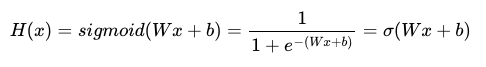
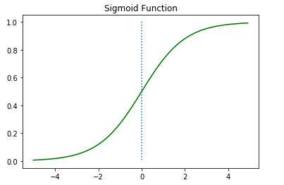
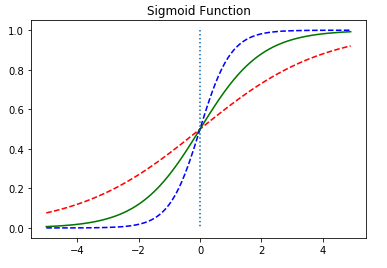
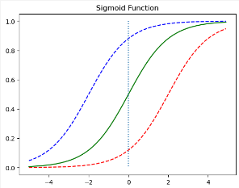
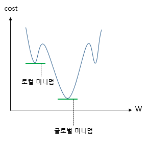
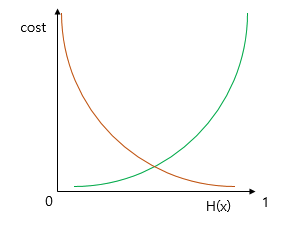
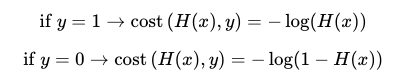
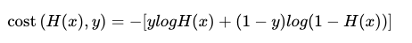
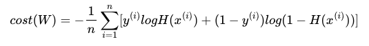

### 예제
- 01 [로지스틱 회귀](https://github.com/leeyejin1231/start-pytorch/blob/main/04.%EB%A1%9C%EC%A7%80%EC%8A%A4%ED%8B%B1%20%ED%9A%8C%EA%B7%80/04-01%20%EB%A1%9C%EC%A7%80%EC%8A%A4%ED%8B%B1%20%ED%9A%8C%EA%B7%80.ipynb)
- 02 [nn.Module로 구현하는 로지스틱 회귀](https://github.com/leeyejin1231/start-pytorch/blob/main/04.%EB%A1%9C%EC%A7%80%EC%8A%A4%ED%8B%B1%20%ED%9A%8C%EA%B7%80/04-02%20nn.Model%EB%A1%9C%20%EA%B5%AC%ED%98%84%ED%95%98%EB%8A%94%20%EB%A1%9C%EC%A7%80%EC%8A%A4%ED%8B%B1%20%ED%9A%8C%EA%B7%80.ipynb)
- 03 [클래스로 파이토치 모델 구현하기](https://github.com/leeyejin1231/start-pytorch/blob/main/04.%EB%A1%9C%EC%A7%80%EC%8A%A4%ED%8B%B1%20%ED%9A%8C%EA%B7%80/04-03%20%ED%81%B4%EB%9E%98%EC%8A%A4%EB%A1%9C%20%ED%8C%8C%EC%9D%B4%ED%86%A0%EC%B9%98%20%EB%AA%A8%EB%8D%B8%20%EA%B5%AC%ED%98%84%ED%95%98%EA%B8%B0.ipynb)

## 로지스틱 회귀

$$H(x) = f(Wx+b)$$

### 1. 시그모이드 함수

  

여기서 W는 경사도를 의미  

-   W가 커지면 경사가 가파라짐
-   W가 작아지면 경사가 완만해짐

b는 이동  

-   +b 파랑
-   -b 빨강

### 2. 시그모이드 함수를 이용한 분류

output: 0과 1사이 값
이진 분류에서 쓰임

### 3. Loss function

  
MSE 사용시 로컬 미니멈 문제발생

#### 시그모이드의 오차함수

  
y = 0.5 에 대칭

로그를 씌워 표현
  
  
오차의 평균 구하기  

