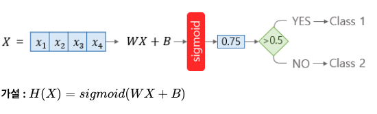
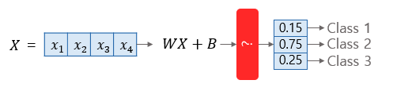
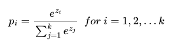
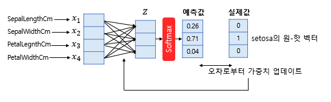
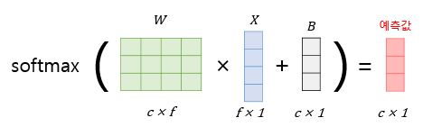
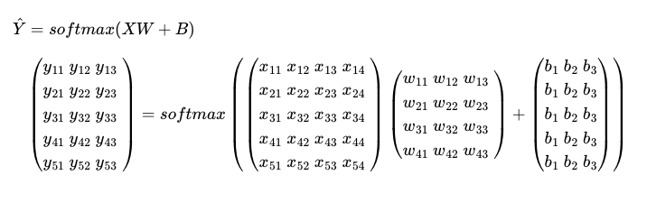
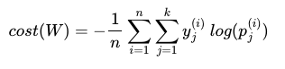
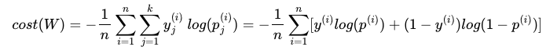

### 예제
- 03 [소프트맥스 회귀의 비용 함수 구현하기](https://github.com/leeyejin1231/start-pytorch/blob/main/05.%EC%86%8C%ED%94%84%ED%8A%B8%EB%A7%A5%EC%8A%A4%20%ED%9A%8C%EA%B7%80/05-03%20%EC%86%8C%ED%94%84%ED%8A%B8%EB%A7%A5%EC%8A%A4%20%ED%9A%8C%EA%B7%80%EC%9D%98%20%EB%B9%84%EC%9A%A9%20%ED%95%A8%EC%88%98%20%EA%B5%AC%ED%98%84%ED%95%98%EA%B8%B0.ipynb)
- 04 [소프트맥스 회귀 구현하기](https://github.com/leeyejin1231/start-pytorch/blob/main/05.%EC%86%8C%ED%94%84%ED%8A%B8%EB%A7%A5%EC%8A%A4%20%ED%9A%8C%EA%B7%80/05-04%20%EC%86%8C%ED%94%84%ED%8A%B8%EB%A7%A5%EC%8A%A4%20%ED%9A%8C%EA%B7%80%20%EA%B5%AC%ED%98%84%ED%95%98%EA%B8%B0.ipynb)
- 05 [소프트맥스 회귀로 MNIST 데이터 분류하기](https://github.com/leeyejin1231/start-pytorch/blob/main/05.%EC%86%8C%ED%94%84%ED%8A%B8%EB%A7%A5%EC%8A%A4%20%ED%9A%8C%EA%B7%80/05-05%20%EC%86%8C%ED%94%84%ED%8A%B8%EB%A7%A5%EC%8A%A4%20%ED%9A%8C%EA%B7%80%EB%A1%9C%20MNIST%20%EB%8D%B0%EC%9D%B4%ED%84%B0%20%EB%B6%84%EB%A5%98%ED%95%98%EA%B8%B0.ipynb)

## 원-핫 인코딩

### 1. 원-핫 인코딩

one-hot vector

### 2. 원-핫 벡터의 무작위성

정수 인코딩과 달리 원-핫 인코딩은 분류 문제 모든 클래스 간의 관계를 균등하게 분배한다. (유클리드 거리 동일)

-   단어의 유사성을 구할 수는 없음

## 소프트맥스 회귀 이해하기

### 1. 다중 클래스 분류

#### 1. Logistic regression

  
시그모이드, 이중분류

#### 2. Softmax regression

  
확률의 합은 1  
$$H(X)=softmax(WX+B)$$

### 2. 소프트맥스 함수

  
i번 째 클래스가 정답일 확률

  
c = 클래스 개수

### 3. 붓꽃 품종 푼류하기 행렬 연산으로 이해하기

### 4. Loss function

#### 1. 크로스 엔트로피

#### 2. 이진 분류에서의 크로스 엔트로피 함수

  
소프트맥스의 비용함수와 로시스틱 회귀의 비용함수는 같다.
