## 머신 러닝 용어 이해하기

### 1. 머신 러닝 모델의 평가

-   Dataset
    -   train_data
    -   valid_data
    -   test_data
-   Hyperparameter
    -   모델 성능 조정
-   Parameter
    -   weight, bias (학습을 통해 바뀌는 변수)

### 2. 분류와 회귀

#### 1. 이진 분류(Binary Classfication)

#### 2. 다중 클래스 분류(Multi-class Classification)

#### 3. 회귀 문제(Regression)

연속된 값을 결과로 가짐  
ex) 시계열, 주가..

### 3. 지도 학습과 비지도 학습

#### 1. 지도 학습(Supervised Learning)

예측값과 실제값의 차이를 줄임

#### 2. 비지도 학습(Unsupervised Learning)

ex) Clustering, 차원 축소

#### 3. 강화 학습

어떤 환경 내에서 정의된 에이전트가 현재의 상태를 인식하여, 선택 가능한 행동들 중 보상을 최대화하는 행동 혹은 행동 순서를 선택하는 방법.

### 4. 샘플과 특성

Features ⊂ smaple
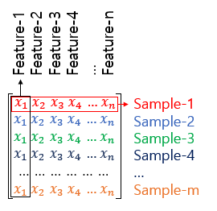

### 5. 혼동 행렬(Confusion matrix)

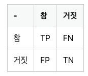  
열 - 예측값  
행 - 실제값  
True/False 정답 여부  
Positive/Negative 제시한 정답  
TP(True Positive), TN(True Negative), FP(False Postivie), FN(False Negative)

#### 1. 정밀도(Precision)

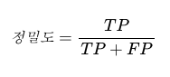  
양성이라고 대답한 전체 케이스에 대한 TP의 비율.

#### 2. 재현률(Recall)

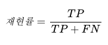  
실제값이 양성인 데이터의 전체 개수에 대한 TP의 비율.

### 6. 과적합과 과소적합

#### Overfitting

과하게 학습  
테스트 데이터의 오차가 증가하기 전이나, 정확도가 감소하기 전에 훈련을 멈추는 것이 바람직함.

Dropout, Early Stopping

#### Underfitting

훈련이 부족.

## 퍼셉트론

### 1. 퍼셉트론(Perceptron)

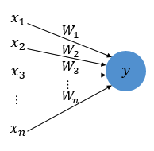  
W - 가중치 (축삭돌기, 클 수록 중요하다는 의미)  
y - 출력값 (원 : 인공뉴런)

#### Step function

Xi와 Wi곱의 전체 합이 임계치(threshold)를 넘으면 종착지에 있는 인공 뉴런은 1을 출력 (아닐 경우 0)
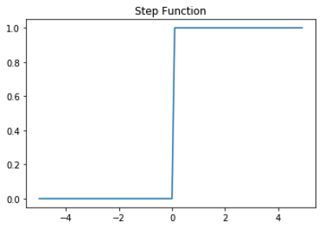

임계치를 bias로 표현할 수도 있음.  
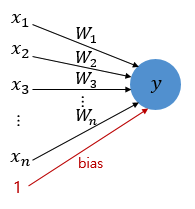  
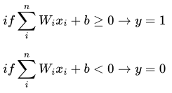

#### 활성화 함수(Activation Function)

-   sigmoid
-   softmax
-   step function..

### 2. 단층 퍼셉트론(Single-Layer Perceptron)

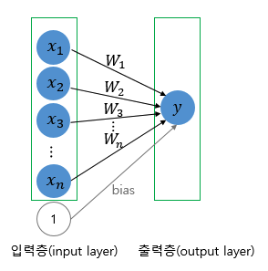  
AND, NAND, OR 구현이 가능하지만 XOR가 불가능! -> MLP

### 3. 다층 퍼셉트론(MultiLayer Perceptron, MLP)

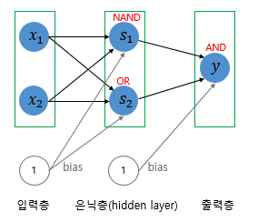  
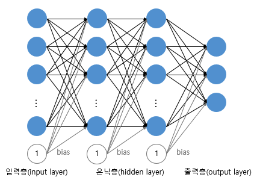  
은닉층이 2개 이상인 신경망을 심층 신경망(Deep Neural Network, DNN)이라 함.

## 역전파(BackPropagation)

### 1. 인공 신경망의 이해

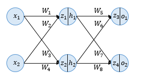

### 2. 순전파

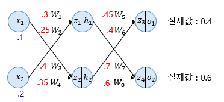  
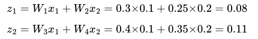  
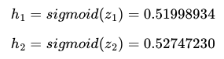  
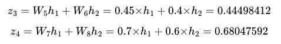
예측값  
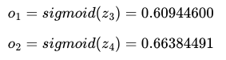  
Loss  
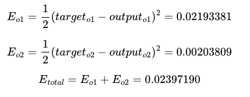

### 3. 역전파 1단계

출력층에서 입력층 방향으로 계산하면서 강중치 업데이트 함.
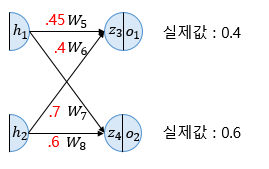

### 4. 역전파 2단계

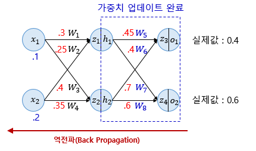  
역전파를 하게되면 loss가 감소함.  
순전파와 역전파를 반복

## 비선형 활성화 함수(Activation function)

### 1. 활성화 함수의 특징 - 비선형 함수

활성화 함수의 특징은 비선형 함수여야 한다는 것이다.

### 2. 시그모이드 함수와 기울기 소실

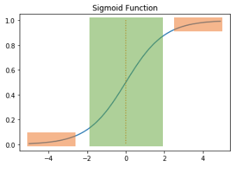  
주황색 부분은 0에 가까운 작은 값이다. 그런데 역전파 과정에서 0에 가까운 아주 작은 기울기가 곱해지게 되면, 기울기가 잘 전달되지 않게 된다. 이러한 현상을 **기울기소실 문제(Vanishing Gradient)** 라고 한다.

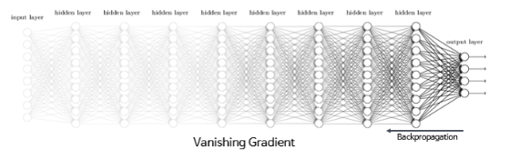  
기울기 소실 문제로 출력층과 가까운 은닉 층에서는 기울기가 잘 전파되지만, 앞단으로 갈 수록 기울기가 제대로 전파되지 않는다.

### 3. 하이퍼볼릭 탄젠트 함수

output : -1 ~ 1
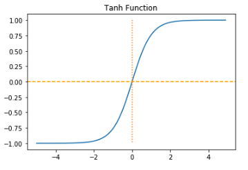  
시그모이드 보다는 기울기 소실 증상이 적지만, -1과 1에 가까운 출력값을 출력할 때 같은 문제 여전히 발생.

### 4. 렐루 함수(ReLU)

$$f(x)=max(0,x)$$  
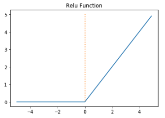

-   음수 = 0
-   양수(x) = x
-   연산이 필요 없음
-   dying ReLU: 입력값이 음수이면 기울기도 0이 됨.

### 4. 리키 렐루(Leaky ReLU)

입력값이 음수이면 매우 작은 수를 반환.  
$$f(x) = max(ax, x)$$  
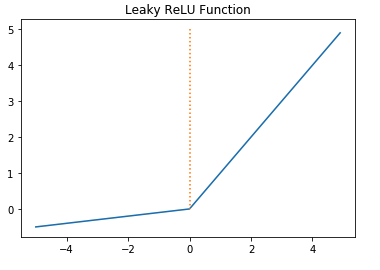

### 6. 소프트맥스 함수

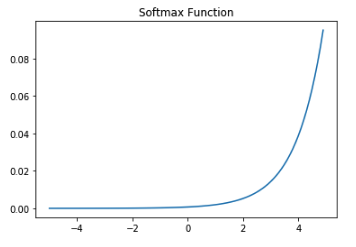  
출력층의 뉴런에서 주로 사용됨.  
다중 클래스 분류 문제에서 주로 사용됨.

### 7. 출력층의 활성화 함수와 오차 함수의 관계

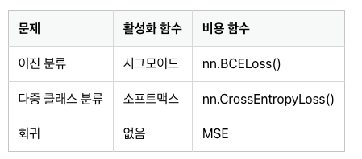

## 과적합을 막는 방법들

### 1. 데이터의 양을 늘리기

노이즈까지 쉽게 암기해버림.  
Data Augmentation

### 2. 모델의 복잡도 줄이기

### 3. 가중치 규제(Regularization) 적용하기

복잡한 모델이 간단한 모델보다 과적합 될 가능성이 높음.

-   L1 규제: 가중치 w들의 절대값 합계를 비용 함수에 추가합니다.
-   L2 규제: 모든 가중치 w들의 제곱합을 비용 함수에 추가합니다. (weight decay, 가중치 감쇠)
-   L2 규제는 L1규제와 달리 가중치들의 제곱을 최소화 하므로 w의 값이 완전히 0이 되기보다는 0에 가까워지는 경향을 띈다.

### 4. 드롭아웃

학습과정에서 신경망의 일부를 사용하지 않는 방법.

드롭아웃은 신경망 학습 시에만 사용하고, 예측 시에는 사용하지 않는 것이 일반적임.

## 기울기 소실과 폭주

### 1. ReLU와 ReLU의 변형들

-   은닉층에서는 시그모이드 함수 사용 X
-   Leaky ReLU는 dying ReLU문제 해결
-   은닉층에서는 ReLU나 ReLU함수의 변형들을 사용할 것

### 2. 가중치 초기화(Weight Initialization)

같은 모델을 훈련시키더라도 가중치가 초기에 어떤 값을 가졌느냐에 따라 모델의 훈련 결과도 달라진다. 따라서 가중치 초기화만 적절히 해줘도 기울기 소실 문제와 같은 문제들을 완화시킬 수 있다.

#### 1. 세이비어 초기화(Xavier Initialization)

여러 층의 기울기 분산 사이에 균형을 맞춰서 특정 층이 주목을 받거나 다른 층이 뒤쳐지는 것을 막는다. 이전 층의 뉴런 개수와 다음 층의 뉴런 개수를 가지고 식을 세운다.  
ReLU와 사용시에는 성능이 좋지 않다. (S자 형태의 활성화 함수는 good)

#### 2. He 초기화(He Initialization)

ReLU를 활성화 함수로 사용할 때 이용하는 초기화.  
다음 층의 뉴런의 수를 반영하지 않는다.

#### 결론

-   시그모이드 함수나 하이퍼볼릭탄젠트 함수를 사용할 경우는 세이비어가 효율적
-   ReLU 계열 함수를 사용할 경우는 He가 효율적
-   ReLU + He 보편적

### 3. 배치 정규화(Batch Normalization)

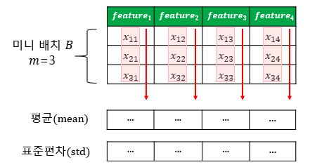  
기울기 소실이나 폭주를 예방하는 또 다른 방법.  
인공 신경망의 각 층에 들어가는 입력을 평균과 분산으로 정규화하여 학습을 효율적으로 만듦.

#### 1. 내부 공변량 변화(Internal Covariate Shift)

층 별로 입력 데이터 분포가 달라지는 현상

-   공변량 변화는 훈련 데이터의 분포와 테스트 데이터의 분포가 다른 경우를 의미
-   내부 공변량 변화는 신경망 층 사이에서 발생하는 입력 데이터의 분포 변화를 의미

#### 2. 배치 정규화

배치 정규화는 각 층에서 활성화 함수를 통과하기 전에 수행됨.  
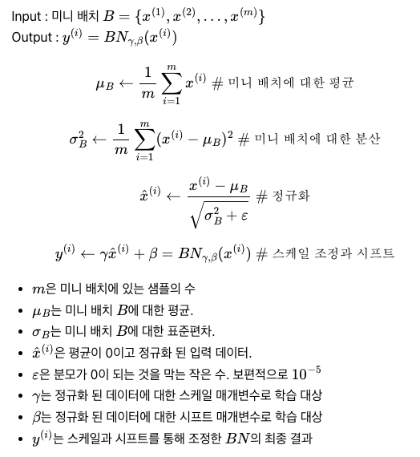

-   시그모이드 함수나 하이퍼볼릭 탄젠트 함수를 사용하여도 기울기 소실문제 개선
-   가중치 초기화에 덜 민감
-   미니 배치마다 평균과 표준편차를 계산하므로 훈련 데이터에 일종의 잡음을 넣는 부수 효과로 과적합을 방지할 수 있음. (드롭아웃과 함께 사용 권장)
-   모델을 복잡하게 하며, 추가 계산을 하는 것이므로 추론 시간이 느려짐.

#### 3. 배치 정규화의 한계

-   미니 배치 크기에 의존적임  
     너무 작은 배치에서는 잘 동작하지 않을 수 있음.
-   RNN에 적용하기 어려움  
     time step마다 다른 통계치를 가지기 때문에 어려움. 따라서 층 정규화 도입

### 5. 층 정규화(Layer Normalization)

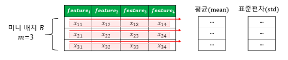
