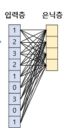
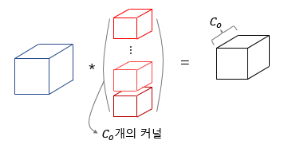

## 합성곱과 풀링

### 1. 합성곱 신경망의 대두

이미지 처리를 위해

### 2. 채널

(높이, 너비, 채널)

-   높이: 세로 방향 픽셀 수
-   너비: 가로 방향 픽셀 수
-   채널: 색 성분 RGB

### 3. 합성곱 연산(Convolution Operation)

연산을 통하여 이미지의 특징을 추출.

커널을 사용하여 합성곱 연산을 통해 나온 결과를 **특성맵(teature map)** 이라고 함.

-   이동범위: stride
-   필터(?): kernel

### 4. 패딩(Padding)

합성곱 연산의 결과로 얻은 특성맵은 입력보다 크기가 작아짐.

따라서 패딩을 더해준다. (주로 zero padding 사용)

### 5. 가중치와 편향

합성곱 신경망은 다층 퍼셉트론을 사용할 때보다 훨씬 적은 수의 가중치를 사용하며 공간적 구조 정보를 보존한다는 특징이 있음.  
 

은닉층을 합성곱 신경망에서는 합성곱 층(convolution layer)라고 함.

#### 1. 합성곱 신경망의 편향

  
커널을 적용한 뒤에 bias가 모든 원소에 더해짐.

### 6. 특성 맵의 크기 계산 방법

  

-   P: 패딩

### 7. 다수의 채널을 가질 경우의 합성곱 연산(3차원 텐서의 합성곱 연산)

  
커널은 3개의 체널을 가진 1개의 커널

### 8. 3차원 텐서의 합성곱 연산

다수의 커널을 사용할 경우  
  
사용한 커널 수는 합성곱 연산의 결과로 나오는 특성 맵의 채널 수가 됨

### 9. 풀링(Pooling)

합성곱 층(합성곱 연산 + 활성화 함수) 다음에는 풀링 층을 추가하는 것이 일반적

풀링 층에서는 특성 맵을 다운샘플링 하여 특성 맵의 크기를 줄이는 풀링 연산이 이루어진다.

#### Max Pooling

-   kernel, strid  
    커널과 겹치는 영역 안에서 최대값을 추출

#### Average Pooling

-   kernel, strid  
    커널과 겹치는 영역 안에서 평균값을 추출

#### 결론

풀링은 학습해야 할 가중치가 없으며, 연산 후에도 채널 수가 변하지 않는다.

## 자연어 처리를 위한 1D CNN

### 1. 2D 합성곱(2D Convolutions)

위에서 열심히 알려준 거

### 2. 1D 합성곱(1D Convolutions)

1D 합성곱 연산에서도 입력이 되는 것은 각 단어가 벡터로 변환된 문장 행렬로 LSTM과 입력을 받는 형태는 동일함.

커널의 너비는 문장 행렬에서의 임베딩 벡터의 차원과 동일함. 따라서 커널의 높이만으로 해당 커널의 크기를 간주함.

'wait for the video and don't rent it' (kernel_size = 2)

커널은 위, 아래로만 이동함.  

커널의 크기가 2라면, bigram  
커널의 크기가 3이라면, trigram

### 3. 맥스 풀링(Max-Pooling)

각 합성곱 연산으로 얻은 결과 벡터에서 가장 큰 값을 가진 스칼라 값을 빼냄.  

### 4. 신경망 설계하기

이진분류, softmax

맥스 풀링 후 얻은 값들을 전부 concatenate하여 하나의 벡터로 만든다. 이를 뉴런이 2개인 출력층에 완전 연결(Dense layer)하여 텍스트 분류 수행한다.
