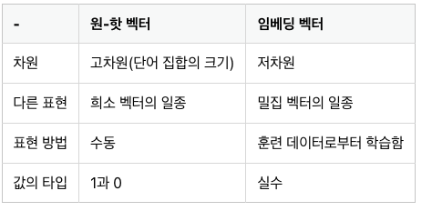
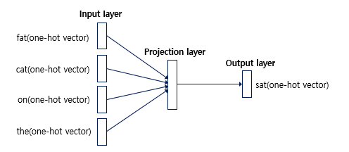
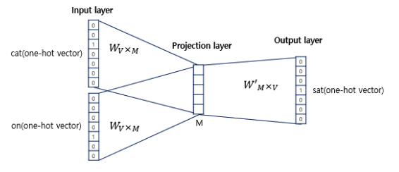
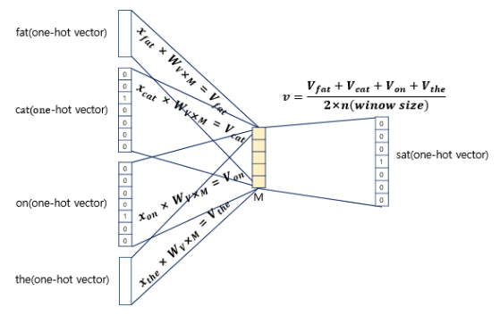
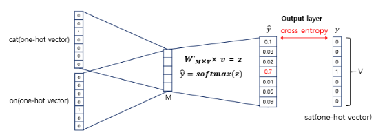
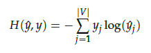
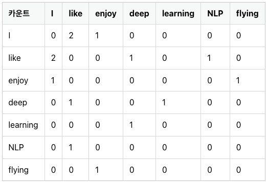
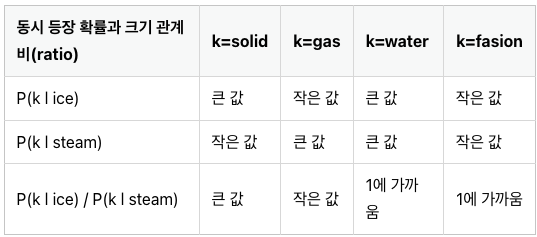
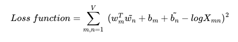

## NLP에서의 원-핫 인코딩
단어의 개수가 늘어날 수록, 벡터를 저장하기 위해 필요한 공간이 계속 늘어난다는 단점이 있다. 유사도 또한 파악할 수가 없다. 

## 워드 임베딩
단어를 벡터로 표현하는 것  
### 1. 희소 표현
희소 벡터 : 대부분의 행렬 값이 0으로 표현되는 방법  
### 2. 밀집 표현
### 3. 워드 임베딩
단어를 밀집(dense vector)의 형태로 표현하는 방법  
  

## 워드투벡터 Word2Vec  
유사도를 반영하기 때문에 연산이 가능  
### 1. 희소 표현
분산 표현 : 단어의 '의미'를 다차원 공간에 벡터화  
### 2. 분산 표현
비슷한 위치에서 등장하는 단어들은 비슷한 의미를 가진다  
희소 표현이 고차원에 각 차원이 분리된 표현 방법이었다면, 분산 표현은 저차원에 단어의 의미를 여러 차원에다가 분산하여 표현. -> 단어간 유사도 계산이 가능  
### 3. CBOW(Continuous Bag of Words)
Word2Vec - (CBOW, Skip-Gram)  
**CBOW** : 주변에 있는 단어들을 가지고, 중간에 있는 단어들을 예측하는 방법  
**Skip-Gram** : 중간에 있는 단어로 주변 단어들을 예측하는 방법  

**center word(중심단어)** : 예측해야하는 단어  
**context word(주변단어)** : 예측에 사용되는 단어  
**window** : 중심 단어를 예측하기 위해서 앞, 뒤로 몇 개의 단어를 볼지 결정 (window=n, 실제 참고 단어 2n)  
**sliding window**: 윈도우를 움직여서 주변 단어와 중심 단어 선택을 바꿔가며 학습을 위한 데이터 셋을 만드는 방법  

#### The fat cat sat on the mat
  

Word2Vec은 Shallow Neural Network이다. 또한 은닉층에 활성화 함수가 존재하지 않고, 룩업 테이블이라는 연산을 담당하는 층으로 일반적인 은닉층과 구분하기 위해 투사층(projection layer)라고 부른다.  

  
V : 단어 집합의 크기   
M : 임베딩 벡터의 차원  

  
각 주변 단어의 원-핫 벡터에 대해서 가중치 W가 곱해서 생겨진 결과 벡터들은 투사층에서 만나 이 벡터들의 평균인 벡터를 구하게된다.   

  
이렇게 구해진 평균 벡터는 두번째 가중치 행렬 W'와 곱해진다. 이 결과에 소프트맥스 함수를 취하여 0과 1사이의 실수를 가지게 된다. (각 원소의 총 합은 1)  
이렇게 나온 벡터가 score vector이다.  

socre vector의 j번째 인텍스가 가진 실수 값은 j번째 단어가 중심 단어일 확률이다. CBOW는 loss function으로 corss-entropy 함수를 사용한다. 

  

### 4. Skip-gram
중심 단어에서 주변 단어를 예측한다.  

  
중심 단어에 대해서 주변 단어를 예측하기 때문에, Projection layer에서 벡터들의 평균을 구하는 과정은 없다.   

전반적으로 Skip-gram이 CBOW보다 성능이 더 좋다.

### 5. 네거티브 샘플링(Negative Sampling)
**SGNS(Skip-Gram with Negative Sampling)**  

모든 단어 집합에 대하여 임베딩을 조정하면 비효율적이다.  

연산량을 줄이기 위해 전체 단어 집합보다 훨씬 작은 단어 집합을 만들어 좋고 마지막 단계를 이진 분류 문제로 바꾼다. 즉, 주변 단어들은 Positive로 두고, 랜덤으로 샘플링이 된 단어들은 Negative로 둔 다음에 이진 분류 문제를 수행한다. 

## 글로브(GloVe)
**Global Vectors for Word Representation**  
카운트 기반과 예측 기반(Word2Vec)을 모두 사용하는 단어 임베딩 방법론이다. 

### 1. 기존 방법론에 대한 비판
LSA는 각 단어의 빈도수를 카운트 한 행렬이라는 전체적인 통계 정보를 입력으로 받아 차원을 축소(Truncated SVD)하여 잠재된 의미를 끌어내는 방법론이다. 코퍼스의 전체적인 통계 정보를 고려한다.   

Word2Vec은 예측 기반으로 단어간 유츄 작업에 뛰어나지만, 코퍼스의 전체적인 통계 정보를 반영하지 못한다. 

### 2. 윈도우 기반 동시 등장 행렬(Window based Co-occurrence Matrix)
행과 열을 전체 단어 집합의 단어들로 구성하고, i 단어의 window size 내에서 k 단어가 등장한 회수를 i행 k열에 기재한 행렬이다.

행렬을 전치해도 동일한 행렬이 된다는 특징이 있다.  

Ex)
I like deep learning  
I like NLP  
I enjoy flying   
  

### 3. 동시 등장 확률(Co-occurrence Probability)
동시 등장 행렬로부터 특정 단어 i의 전체 등장 횟수를 카운트하고, 특정 단어 i가 등장했을 때 어떤 단어 k가 등장한 횟수를 카운트 하여 계산한 조건부 확률이다.  
$$P(k | i)$$  
i : 중심단어  
k : 주변단어  
중심 단어 i의 행의 모든 값을 더한 값을 분모로하고 i행 k열의 값을 분자로 한 값.  
  

### 4. 손실 함수
**GloVe** : 임베딩 된 중심 단어와 주변 단어 벡터의 내적이 전체 코퍼스에서의 동시 등장 확률이 되도록 만드는 것  

  
어렵네요..  

## 파이토치의 nn.Embedding()
### 1. 임베딩 층은 룩업 테이블이다.
어떤 단어 -> 단어에 부여된 고유한 정수값 -> 임베딩 층 통과 -> 밀집 벡터  

**룩업 테이블** : 특정 단어와 맵핑되는 정수를 인덱스로 가지는 테이블로 부터 임베딩 벡터 값을 가져옴. 단어 집합의 크기만 큼 행을 가짐. (모든 단어는 고유한 임베딩 벡터를 가짐)

