### 예제
- 01 [순환신경망](https://github.com/leeyejin1231/start-pytorch/blob/main/10.%20%EC%88%9C%ED%99%98%EC%8B%A0%EA%B2%BD%EB%A7%9D/10-01%20%EC%88%9C%ED%99%98%EC%8B%A0%EA%B2%BD%EB%A7%9D.ipynb)

## 순환 신경망(Recurrent Neural Network, RNN)
입력과 출력을 시퀀스 단위로 처리하는 Sequence 모델.
### 1. 순환 신경망
은닉층의 노드에서 활성화 함수를 통해 나온 결과값을 출력층 방향으로도 보내면서, 다시 은닉층 노드의 다음 계산의 입력으로 보낸다.  

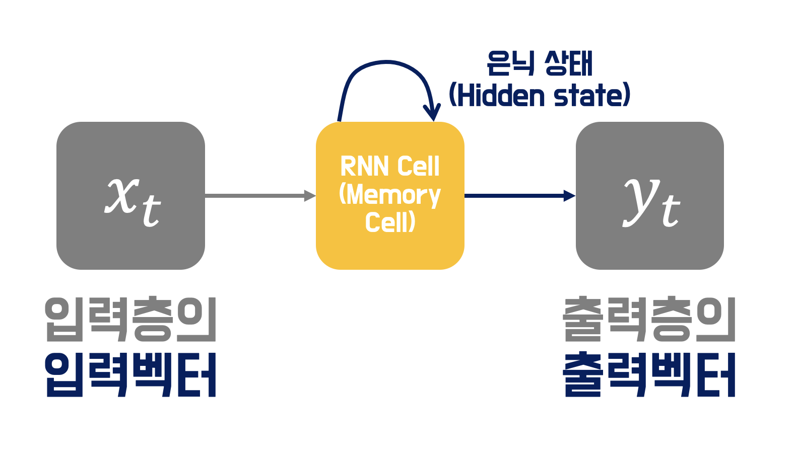  

은닉층의 메모리 셀은 각각 time step에서 바로 이전 시점에서의 은닉층의 메모리 셀에서 나온 값을 자신의 입력으로 사용하는 재귀적인 활동을 함.  

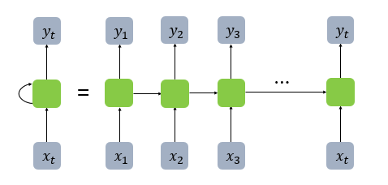  

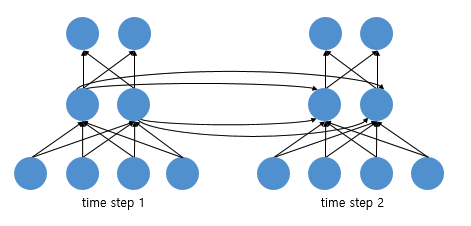  
입력 벡터의 차원이 4, 은닉 상태의 크기가 2, 출력층의 출력 벡터의 차원이 2인 RNN이 시점(time step)이 2일 때의 모습  

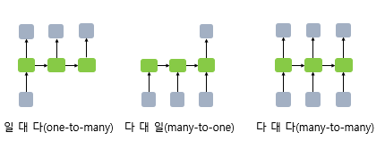  
#### 일 대 다(one-to-many)
ex) 이미지 캡셔닝
#### 다 대 일(many-to-one)
ex) 감성 분류, 스팸 메일 분류
#### 다 대 다(many-to-many)
ex) 번역기, 개체명 인식, 품사 태깅  

#### 수식 정의
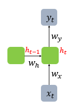  
은닉층 : $$h_t = tanh(W_x x_t + W_h h_{t-1} + b)$$
출력층 : $$y_t=f(W_yh_t+b)$$  
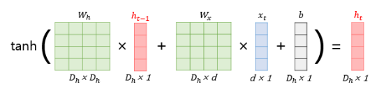  

만약, 은닉층이 2개 이상일 경우에는 은닉층 2개의 가중치는 서로 다르다.  

### 2. 양방향 순환 신경망(Bidirectional Recurrent Neural Network)
양방향 순환 신경망은 시험 t에서의 출력값을 예측할 때 이전 시점의 데이터 뿐만 아니라, 이후 데이터로도 예측할 수 있다는 아이디어에 기반함.  

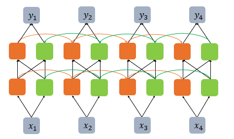  
주황색 : 앞 시점의 은닉 상태(Forward States)  
연두색 : 뒤 시점의 은닉 상태(Backward States)  

## 장단기 메모리(Long Short-Term Memory, LSTM)
### 1. 바닐라 RNN의 한계
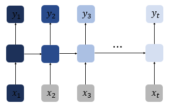  
출력 결과가 이전의 계산 결과에 의존한다. time step이 길어질 수록 앞의 정보가 뒤로 충분히 전달되지 못하는 현상이 발생하게 된다. 

**장기 의존성 문제(the problem of Long-Term Dependencies)** 발생
 
### 2. 바닐라 RNN 내부 열어보기
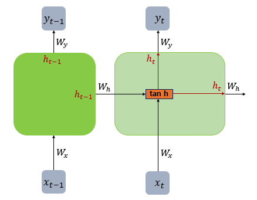  
$$h_t=tanh(W_xx_t+W_hh_{t-1}+b)$$

### 3. LSTM(Long Short-Term Memory)
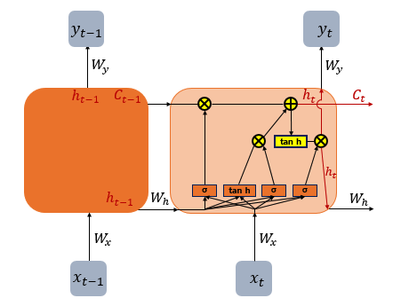  
은닉층의 메로리 셀에 입력 게이트, 망각 게이트, 출력 게이트를 추가하여 불필요한 기억을 지우고, 기억해야할 것들을 정한다.  

#### (1) 입력 게이트
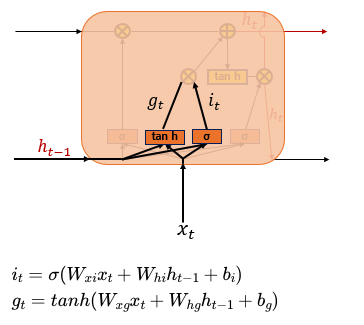  
현재 정보를 기억하기 위한 게이트이다.  
시그모이드 함수를 지나 0과 1사이의 값과 하이퍼볼릭탄젠트 함수를 지나 -1과 1사이의 값 두개가 나오게 된다.   

#### (2) 삭제 게이트
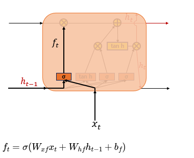  
기억을 삭제하기 위한 게이트이다.  
시그모이드 함수를 지나면 0과 1사이의 값이 나오게 되는데, 이 값이 곧 삭제 과정을 거친 정보의 양이다. 0에 가까울 수록 정보가 많이 삭제된 것이고, 1에 가까울 수록 정보를 온전히 기억한 것이다. 

#### (3) 셀 상태(장기 상태)
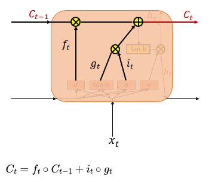  
입력게이트에서 구한 두개의 값에 대해서 원소별 곱을 진행한 것이 이번에 선택된 기억할 값이다.  

이렇게 입력 게이트에서 선택된 기억을 삭제 게이트의 결과값에 더하게 된다. 

#### (4) 출력 게이트와 은닉 상태(단기 상태)
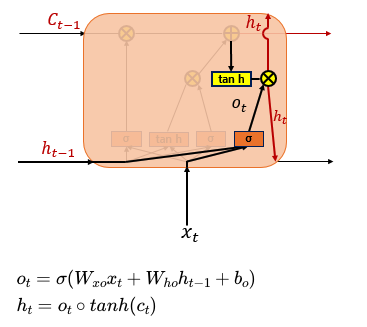  
출력 게이트는 현재 시험 t의 x값과 이전 시점 t-1의 은닉 상태가 시그모이드 함수를 지난 값이다.  

셀 상태의 값이 하이퍼 볼릭 탄젠트 함수를 지나 -1과 1사이의 값이 되고, 이 값은 출력 게이트 값과 연산되어 값이 걸러지는 효과가 발생한다. 은닉 상태의 값은 출력층으로도 향하게 된다. 

## 게이트 순환 유닛(Gated Recurrent Unit, GRU)
LSTM의 장기 의존성 문제에 대한 해결책을 유지하면서, 은닉 상태를 업데이트 하는 계산을 줄였다.
### 1. GRU(Gated Recurrent Unit)
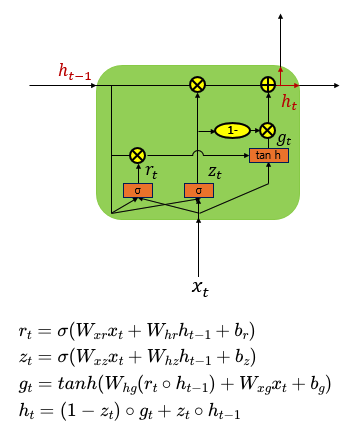  
업데이트 게이트와 삭제 게이트 두 가지 게이트만 존재한다.  
#### 속도
LSTM < GRU
#### 성능
LSTM ⩬ GRU  

데이터의 양이 적을 때는 매개 변수의 양이 적은 GRU,  
데이터 양이 더 많으면 LSTM
