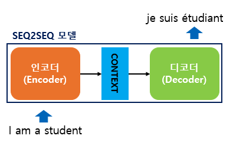
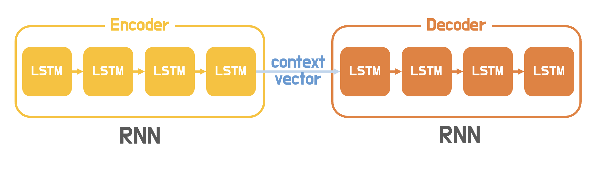
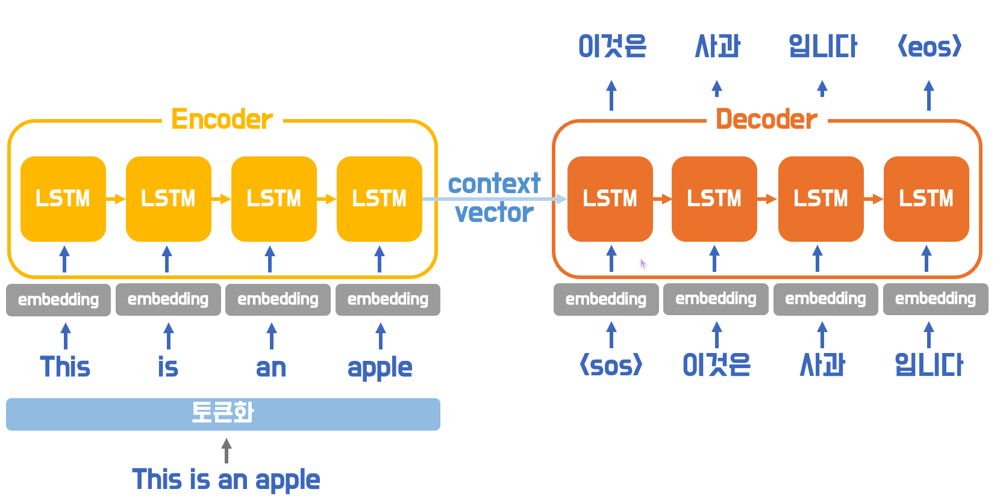
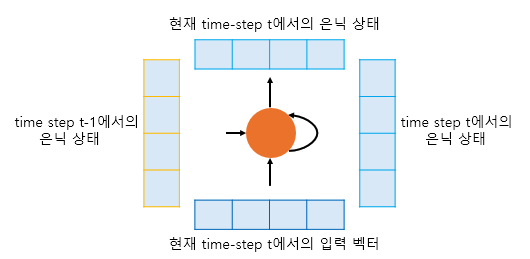
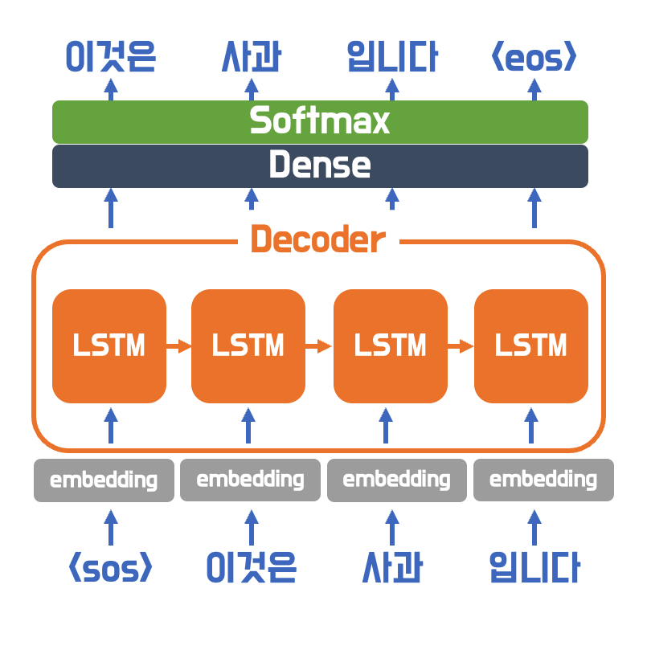

## 시퀀스투시퀀스 (Sequence-to-Sequence)
ex) 챗봇, 번역기, Text Summarization, STT ..
### 1. 모델의 개요
seq2seq는 번역기에서 대표적으로 사용되는 모델으로, 인코더와 디코더로 구성되어 있다.  
인코더는 입력 문장의 모든 단어들을 순차적으로 입력받은 뒤에 마지막에 이 모든 단어 정보들을 압축해서 하나의 벡터로 만드는데, 이를 context vector라고 한다.  
  

### 2. seq2seq의 동작 과정
  
SLTM이나 GRU를 사용하여 구성된다.  

#### 1. 테스트 단계
- 디코더는 초기 입력으로 문장의 시작을 의미하는 심볼 \<sos>가 들어간다.   
- 디코더는 기본적으로 다음에 올 단어를 예측하고, 그 예측한 단어를 다음 시점의 RNN 셀의 입력으로 넣는 행위를 반복한다.  
- 문장의 끝을 의미하는 심볼인 \<sos>가 다음 단어로 올때까지 반복한다. 

#### 2. 훈련 단계와 교사 강요
**\<sos> 이것은 사과 입니다** 를 입력 받았을 때, **이것은 사과 입니다 \<eos>** 가 나와야 된다고 정답을 알려주면서 하는 훈련을 **교사 강요(teaching forcing)** 이라고 한다.  

디코더는 오직 context vector와 \<go>만을 입력으로 받은 후에 다음에 올 단어를 예측하고, 그 단어를 다음 시점의 RNN 셀의 입력으로 넣는 행위를 반복한다.   

#### 3. 임베딩 층
  

#### 4. RNN 셀
  
context vector는 사실 인코더에서의 마지막 RNN 셀의 은닉 상태값을 말하며, 이는 입력 문장의 모든 단어 토큰들의 정보를 요약해서 담고있다고 할 수 있다.  

#### 5. 디코더
  
디코더는 인코더의 마지막 RNN 셀의 은닉 상태인 Context vector를 첫 번째 은닉 상태의 값으로 사용한다.   

디코더에서 각 time step의 RNN 셀에서 출력 벡터가 나오면, 해당 벡터는 소프트맥스 함수를 통해 출력 시퀀스의 각 단어별 확률값을 반환하고, 디코더는 출력 단어를 결정한다. 

### 3. 다양한 변형들
에이 티티 이 엔티 아이 온 ~ 어텐션 ~ 이즈 왓아원 ~